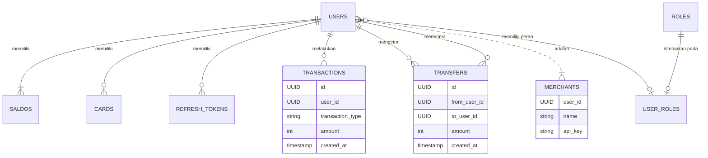

# Payment Gateway GraphQL

Proyek ini adalah implementasi sebuah sistem _payment gateway_ sederhana yang dibangun menggunakan **Go (Golang)** dengan antarmuka API berbasis **GraphQL**. Sistem ini dirancang untuk menangani operasi keuangan dasar seperti manajemen pengguna, saldo, transfer, top-up, dan lainnya.

Arsitektur proyek ini mengadopsi pendekatan _clean architecture_ untuk memisahkan lapisan logika bisnis, akses data, dan presentasi, sehingga membuatnya mudah untuk dikelola dan dikembangkan lebih lanjut.

## Fitur Utama

- **Manajemen Pengguna:** Registrasi dan login pengguna.
- **Otentikasi & Otorisasi:** Menggunakan JWT (JSON Web Tokens) untuk otentikasi dan sistem _role-based access_ untuk otorisasi.
- **Manajemen Merchant:** Pengguna dapat mendaftar sebagai merchant dan mendapatkan API key.
- **Manajemen Saldo:** Setiap pengguna memiliki saldo virtual.
- **Top-Up:** Menambah saldo dari sumber eksternal (simulasi).
- **Transfer:** Transfer dana antar pengguna dalam sistem.
- **Penarikan (Withdraw):** Menarik dana dari saldo ke rekening eksternal (simulasi).
- **Riwayat Transaksi:** Mencatat semua aktivitas keuangan pengguna.
- **Manajemen Kartu:** Pengguna dapat menyimpan informasi kartu (nomor VCC acak).

## Tumpukan Teknologi

- **Bahasa:** Go (Golang)
- **API:** GraphQL (menggunakan library [gqlgen](https://github.com/99designs/gqlgen))
- **Database:** PostgreSQL
- **ORM & Query Builder:** [sqlc](https://github.com/sqlc-dev/sqlc) untuk menghasilkan kode Go yang _type-safe_ dari query SQL.
- **Migrasi Database:** [golang-migrate](https://github.com/golang-migrate/migrate)
- **Routing & Middleware:** [chi](https://github.com/go-chi/chi)
- **Konfigurasi:** Variabel lingkungan (environment variables) dengan library `godotenv`.

## Arsitektur Sistem

Sistem ini dibangun dengan arsitektur berlapis (_layered architecture_) untuk memastikan pemisahan tanggung jawab (_separation of concerns_).


**Penjelasan Alur:**

1.  **Client/User:** Pengguna mengirimkan _request_ (query atau mutation) ke server GraphQL.
2.  **GraphQL Server (gqlgen):** Menerima _request_ dan meneruskannya melalui serangkaian _middleware_.
3.  **Middleware:** Melakukan pengecekan seperti otentikasi (apakah token valid?), otorisasi (apakah pengguna memiliki hak akses?), CORS, dll.
4.  **GraphQL Resolvers:** Fungsi yang dieksekusi untuk setiap _field_ dalam query. Resolver ini bertindak sebagai jembatan antara GraphQL dan logika bisnis.
5.  **Service Layer:** Lapisan ini berisi semua logika bisnis inti (misalnya, validasi transfer, perhitungan saldo, dll).
6.  **Repository Layer:** Lapisan abstraksi untuk akses data. Lapisan ini mendefinisikan _interface_ untuk operasi database (CRUD, dll).
7.  **sqlc (Generated Code):** Implementasi dari _repository_ yang menggunakan kode yang dihasilkan secara otomatis oleh `sqlc` dari file-file query SQL.
8.  **PostgreSQL Database:** Tempat data disimpan secara persisten.

## Entity-Relationship Diagram (ERD)

Diagram berikut menggambarkan hubungan antar entitas utama dalam database.



## Cara Menjalankan di Lokal

Berikut adalah panduan untuk menginstal dan menjalankan proyek ini di komputer lokal Anda.

### 1. Prasyarat

- **Go:** Versi 1.20 atau lebih baru.
- **PostgreSQL:** Database server yang sedang berjalan.
- **Docker:** (Opsional) Direkomendasikan untuk menjalankan PostgreSQL dengan mudah.
- **make:** Untuk menjalankan perintah-perintah dari `Makefile`.
- **golang-migrate:** Untuk menjalankan migrasi database. Instal dengan:
  ```sh
  go install -tags 'postgres' github.com/golang-migrate/migrate/v4/cmd/migrate@latest
  ```

### 2. Kloning Repositori

```sh
git clone https://github.com/MamangRust/paymentgateway-graphql
cd paymentgateway-graphql
```

### 3. Konfigurasi Lingkungan

Salin file `.env.example` (jika ada) atau buat file baru bernama `.env` dan isi dengan konfigurasi yang sesuai.

```env
# Konfigurasi Database
DB_HOST=localhost
DB_PORT=5432
DB_USER=postgres
DB_PASSWORD=yourpassword
DB_NAME=payment_gateway
DB_SSL_MODE=disable

# Konfigurasi Aplikasi
APP_PORT=8080

# Konfigurasi JWT
JWT_SECRET_KEY=your_super_secret_key
JWT_EXPIRATION_HOURS=24
```

### 4. Menjalankan Database (Contoh dengan Docker)

Jika Anda menggunakan Docker, Anda bisa menjalankan PostgreSQL dengan perintah berikut:

```sh
docker run --name pg-payment -e POSTGRES_USER=postgres -e POSTGRES_PASSWORD=yourpassword -e POSTGRES_DB=payment_gateway -p 5432:5432 -d postgres
```

### 5. Migrasi Database

Jalankan migrasi untuk membuat skema tabel di database Anda. Pastikan `DB_HOST`, `DB_USER`, dll. di `.env` sudah benar.

Gunakan perintah dari `Makefile`:

```sh
make migrate-up
```

Jika Anda perlu membatalkan migrasi terakhir:

```sh
make migrate-down
```

### 6. Instal Dependensi

```sh
go mod tidy
```

### 7. Hasilkan Kode GraphQL & SQLC

Proyek ini menggunakan `gqlgen` dan `sqlc` untuk _code generation_. Jalankan perintah berikut untuk menghasilkan kode yang diperlukan:

```sh
make generate
```

### 8. Jalankan Aplikasi

Sekarang Anda bisa menjalankan server utama:

```sh
make run
```

Server akan berjalan di `http://localhost:8080` (atau port yang Anda tentukan di `.env`).

### 9. Akses GraphQL Playground

Buka browser dan navigasi ke `http://localhost:8080`. Anda akan disambut oleh GraphQL Playground, di mana Anda bisa mulai mengirim _queries_ dan _mutations_.

## Perintah yang Tersedia (`Makefile`)

- `make run`: Menjalankan server aplikasi utama.
- `make generate`: Menghasilkan kode dari `sqlc` dan `gqlgen`.
- `make migrate-up`: Menjalankan semua migrasi database yang tertunda.
- `make migrate-down`: Membatalkan migrasi database terakhir.
- `make sqlc`: Hanya menjalankan `sqlc generate`.
- `make graphql-generate`: Hanya menjalankan `gqlgen generate`.
